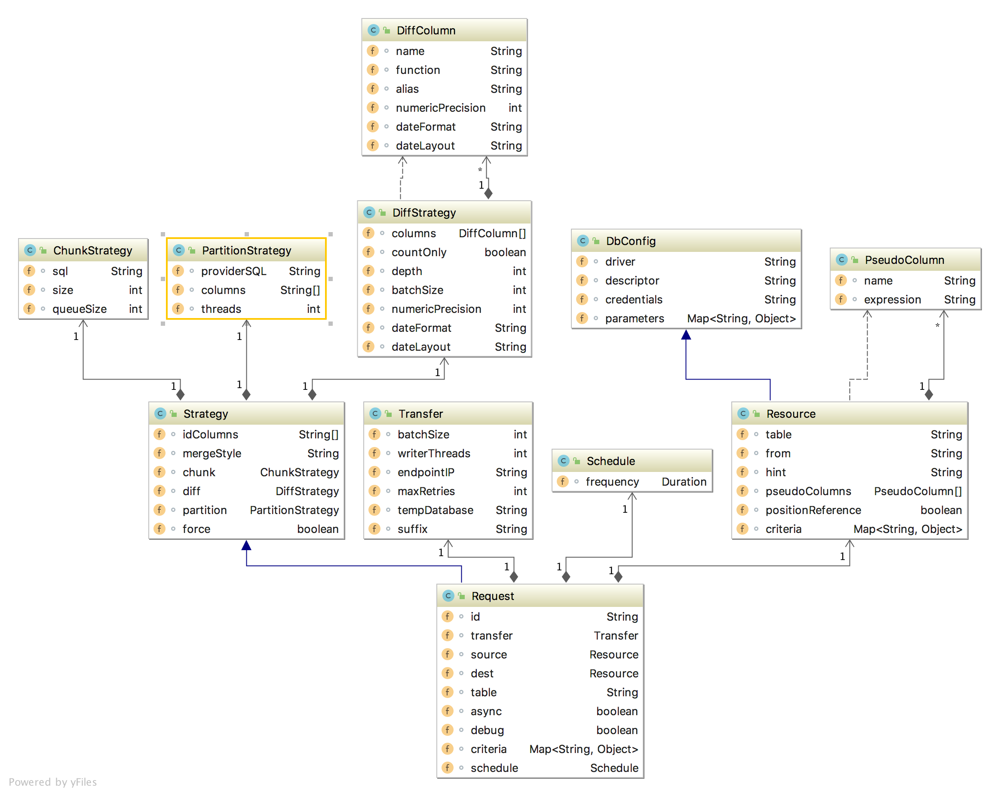

# dbsync - SQL database cost effective synchronization

### Motivation

While there are many database solutions providing replication within the same vendor.
this project provides SQL based cross database vendor data synchronization.
You may easily synchronize small or large(billions+ records) tables/views in a cost effective way.
This is achieved by both determining the smallest changed dataset and by dividing dataset in the smaller chunks.

### Introduction

##### 1. Synchronization status

In this step, synchronizer uses aggregation function to compare source and destination table.
In case of data discrepancy, the process narrows down source dataset to the one that has been changed.
When chunks are used, on top of narrowing source dataset, only out of sync chunks are transferred to destination database.

##### 2. Data transfer

Changed dataset is moved from source to transient table in destination database with transfer service.
Transfer service streamlines data copy with parallel writes and compacted collections.
On top of that large dataset can be divided in to smaller transferable chunks by sync process, which 
provides additional level of the read paralelization and 

##### 3. Data Merge

During checking synchronization status, sync process determines merge strategy based on the changed dataset
which can could be one of the following:

- insert - append data to destination table
- merge  - append or update data in destination table
- delete merge - remove data from destination table if it does not exist in transferred transient table, then merge
- delete insert - remove data from destination table if it does not exist in transferred transient table, then append

### Contract

#######  Sync service contract

####### Transfer service contract

### Usage

##### Managing diff strategy

##### Managing partition strategy
 
##### Managing chunk strategy

##### Managing transfer

##### Pseudo columns

##### Non PK tables synchronization

##### Applying custom filters

##### Query based synchronization

### Running e2e tests

### Deployment
1. Standalone services
2. Docker compose
3. Cloud run
4. Kubernetes

### Supported database

### Custom build

